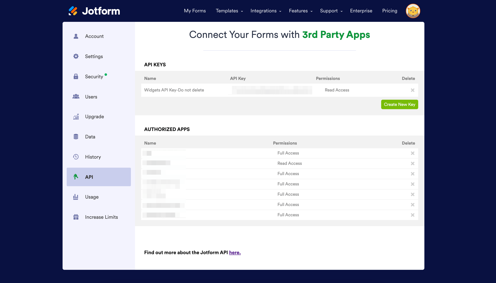

# Jotform_Bitrix24_Integration

## Setup
```bash
# Clone project
$ git clone https://github.com/dungnq271/Jotform_Bitrix24_Integration.git
# Use npm or pnpm (recommended) to install libraries:
$ npm i -g @nestjs/cli
$ npm i --save class-validator class-transformer @nestjs/axios axios
# Start the project
$ npm run start
```
## Jotform API

- Go to [link](https://www.google.com/url?sa=t&source=web&rct=j&opi=89978449&url=https://www.jotform.com/signup/&ved=2ahUKEwiM__6unr6PAxW_dvUHHXPgIYsQmuEJegQIJxAB&usg=AOvVaw1YvGhwGQjmPTdfOrF0h-Q_) to create Jotform account
- Go to [My Account](https://www.jotform.com/myaccount/api)
- Navigate to API section
- Create a new API key
<div align="center">
	
</div>
